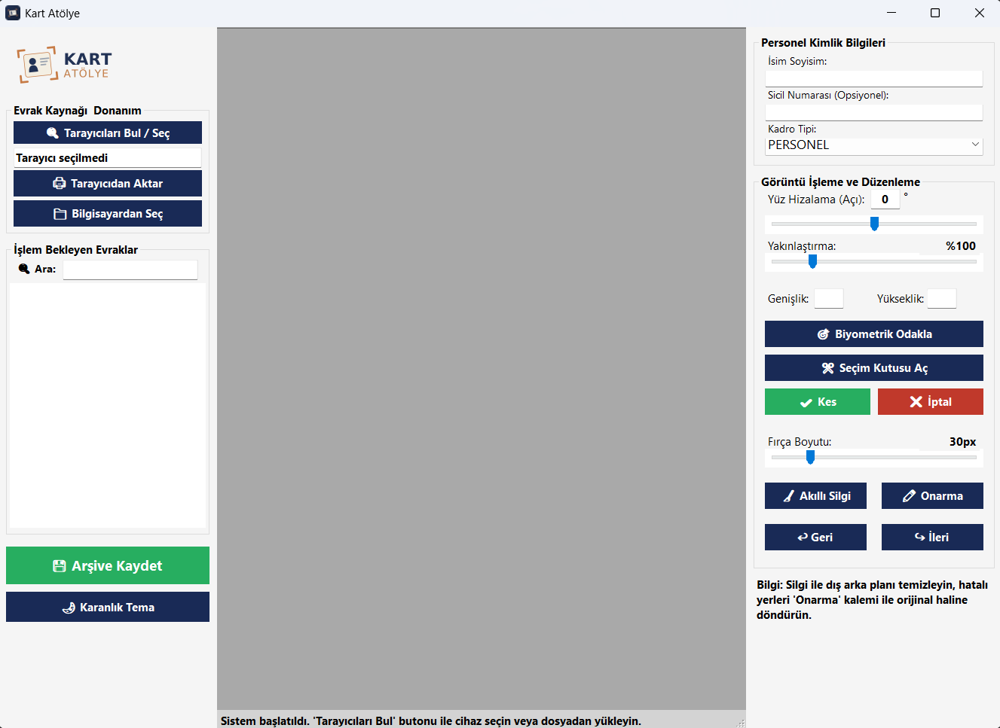
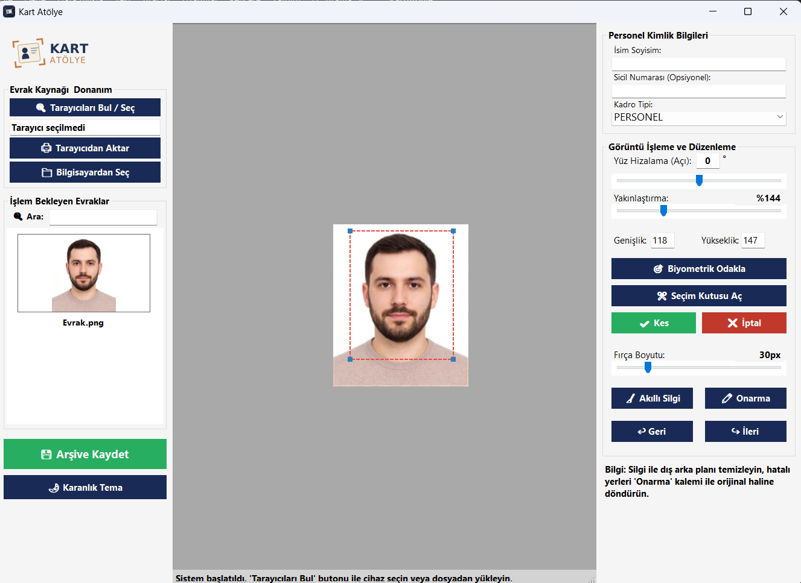
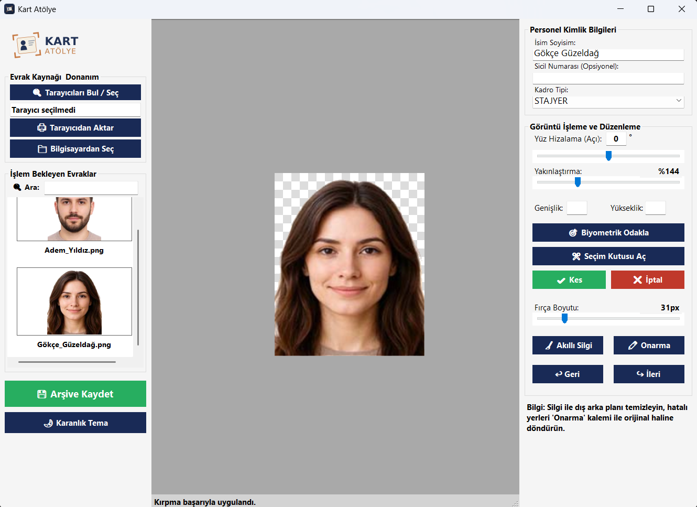

<div align="center">

# 📸 Kart Atölye

**Kurumsal Kimlik ve Evrak İşleme Sistemi**

[](#)
[](#)
[](#)

Kart Atölye, kamu kurumları ve büyük ölçekli işletmelerin personel kimlik kartı basım süreçlerini ve evrak dijitalleştirme operasyonlarını hızlandırmak için geliştirilmiş bir masaüstü uygulamasıdır. WIA altyapısı ile tarayıcılarla doğrudan haberleşir, GDI+ ile Photoshop benzeri tahribatsız (non-destructive) bir görüntü işleme mimarisi sunar.

</div>

---

## 🚀 Temel Özellikler

* **🖨️ Donanım Entegrasyonu (WIA):** Yerel ağdaki veya USB ile bağlı tarayıcıları otomatik tanır ve doğrudan uygulama içine yüksek çözünürlüklü tarama yapar.
* **🎯 Biyometrik Odaklama:** 50x60 mm (1:1.2) standart biyometrik vesikalık oranını baz alarak görüntüleri otomatik veya manuel olarak kırpar.
* **🧹 Akıllı Silgi & Onarma:** Arka plan temizleme işlemleri için optimize edilmiş fırça aracı. Orijinal görüntüyü referans alan "Onarma" (History Brush) aracı ile hatalı silinen yerler geri getirilebilir.
* **🧠 Gelişmiş Bellek Yönetimi:** İşlemlerde RAM şişmesini önlemek için piksellere `LockBits` ile doğrudan müdahale edilir. Sınırsız "Geri (Undo)" ve "İleri (Redo)" özellikleri bellek dostu bir mimariyle (`DocState`) çalışır.
* **📂 Akıllı Kurumsal Arşivleme:** İşlenen evrakları kullanıcının seçtiği ana dizine `[Kadro Tipi] / [Ay Yıl] / [Baş Harf] / İsim_SicilNo.png` hiyerarşisiyle otomatik sınıflandırarak kaydeder.
* **🌓 Arayüz Seçenekleri:** Göz yorgunluğunu azaltmak için Karanlık (Dark) ve Aydınlık (Light) tema desteği. Gerçek zamanlı arama/filtreleme sunan evrak kuyruğu.

---

## 🖼️ Ekran Görüntüleri ve Kullanım

### 1. Tarama ve İşlem Bekleyen Evraklar
Tarayıcıdan veya bilgisayardan alınan görüntüler sol panele listelenir. Dinamik arama kutusu ile yüzlerce evrak arasında isim veya sicil numarasına göre anında filtreleme yapılabilir.



### 2. Keskin Biyometrik Kırpma Sistemi
Resim yakınlaştırma (Zoom) ve kaydırma (Pan) özellikleri aktifken bile seçim kutusu koordinatlarını kaybetmez. Kart basım standartlarına uygun hassas kırpma sağlar.



### 3. Akıllı Silgi ile Arka Plan Temizliği
Karmaşık arka planlar akıllı silgi ile şeffaflaştırılır (.png formatında). Hata yapıldığında onarma kalemi, resmin arka planda tutulan orijinal/master kopyasından pikselleri kopyalayarak restorasyon sağlar.



---

## 🛠️ Teknik Altyapı ve Mimari

| Teknoloji | Açıklama |
| :--- | :--- |
| **Dil & Platform** | C#, .NET Framework, Windows Forms |
| **Görüntü İşleme** | `System.Drawing`, `System.Drawing.Imaging`, `LockBits` (Pointer seviyesinde yüksek performanslı piksel manipülasyonu) |
| **Tarayıcı Protokolü** | `WIA` (Windows Image Acquisition) COM bileşeni |
| **Tasarım Deseni** | Non-destructive editing (Tahribatsız düzenleme). Her evrak `OriginalScan`, `WorkingMaster` ve `CurrentImage` katmanlarında yönetilir. |

---

## ⚙️ Kurulum ve Çalıştırma

1. Repoyu bilgisayarınıza klonlayın:
   ```bash
   git clone [https://github.com/KULLANICI_ADINIZ/KartAtolye.git](https://github.com/KULLANICI_ADINIZ/KartAtolye.git)

2. Projeyi Visual Studio ile açın.

3. Proje referanslarında Microsoft Windows Image Acquisition Library v2.0 (WIA) bileşeninin eklendiğinden emin olun. (Eksikse: Add Reference -> COM -> Microsoft Windows Image Acquisition Library v2.0 adımlarını izleyin).

4. Çözümü derleyin (Build) ve çalıştırın.

👨‍💻 Geliştirici
Mustafa Aslan - Bilgisayar Mühendisi
